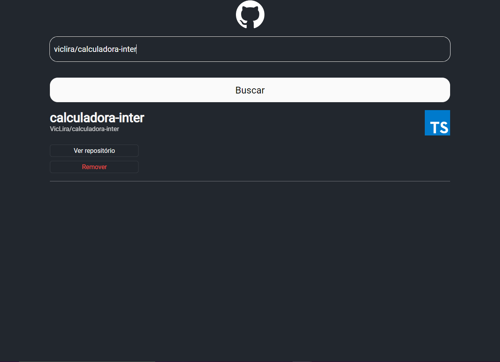

<h1 align="center"> Github Wiki </h1>

Conteudo exclusivo e gratuito, promovido pela DIO para ensino de tecnologias WEB.

  <a href="#-tecnologias">Tecnologias</a>&nbsp;&nbsp;&nbsp;|&nbsp;&nbsp;&nbsp;
  <a href="#-projeto">Projeto</a>&nbsp;&nbsp;&nbsp;|&nbsp;&nbsp;&nbsp;
  <a href="#memo-licença">Licença</a>

  

 

  

## 🚀 Tecnologias

Esse projeto foi desenvolvido com as seguintes tecnologias:

- create-react-app
- [TypesScript](https://www.typescriptlang.org/)
- [yarn](https://yarnpkg.com/)
- [Styled-components](https://styled-components.com/)

## 💻 Projeto

Projeto desenvolvido durante aulas de react bootcamp Inter da DIO

## :memo: Licença

Esse projeto está sob a licença MIT.